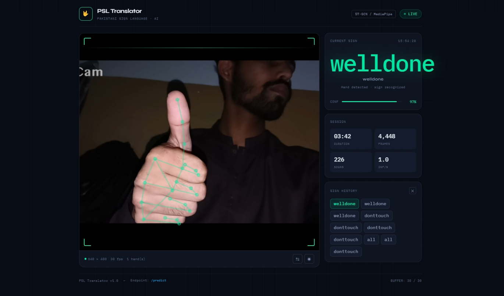

# Pakistani Sign Language Recognition — ST-GCN

[](https://www.python.org/)
[](https://pytorch.org/)
[](https://google.github.io/mediapipe/solutions/hands.html)
[](https://fastapi.tiangolo.com/)
[](https://opencv.org/)

## Introduction

This project recognizes **Pakistani Sign Language (PSL)** hand gestures in real time using a **Spatio-Temporal Graph Convolutional Network (ST-GCN)**. Hand landmarks are extracted with **MediaPipe Hands** and modeled as a graph over time, letting the network learn both the *shape* of a sign (spatial) and its *motion* (temporal).

The repo includes everything from raw-dataset preprocessing to training, a live webcam demo, and a browser-accessible FastAPI backend served over HTTPS.

## Demo



*The browser-based demo detecting the "welldone" sign in real time, with hand-landmark overlay, confidence score, and session stats.*

## Features

- **Landmark extraction** — converts a folder of labeled sign images into MediaPipe hand-keypoint sequences
- **ST-GCN training pipeline** — trains a graph convolutional classifier on the extracted keypoints
- **Live webcam recognition** — real-time OpenCV demo with on-screen predictions and confidence scores
- **Web-based demo** — FastAPI + uvicorn backend so the model can be used from a browser over HTTPS

## Project Structure

```
Pakistani-Sign-Language-ST-GCN/
├── backend/              # FastAPI app serving the model over HTTPS
├── src/                  # ST-GCN model definition + training loop
├── Rawhtml/              # Frontend page(s) for the browser demo
├── static/               # Static assets used by the backend
├── extract_landmarks.py  # Extracts MediaPipe hand landmarks from the dataset
├── inspect_dataset.py    # Utility for inspecting/validating the dataset
├── live_test.py          # Real-time webcam sign recognition (OpenCV window)
├── main.py               # Training entry point
├── label_map.json        # Class index → sign label mapping
├── stgcn_model.pth       # Trained model weights
└── requirements.txt
```

## Requirements

- Python 3.10 or 3.11
- Packages: `fastapi`, `uvicorn`, `torch`, `numpy`, `pydantic`, `pyopenssl`, `mediapipe`, `opencv-python`

## Getting Started

### 1. Clone the repository

```bash
git clone https://github.com/Abahad-bit/Pakistani-Sign-Language-ST-GCN.git
cd Pakistani-Sign-Language-ST-GCN
```

### 2. Set up a virtual environment (recommended)

```bash
python -m venv venv
source venv/bin/activate      # Windows: venv\Scripts\activate
```

### 3. Install dependencies

```bash
pip install fastapi uvicorn torch numpy pydantic pyopenssl mediapipe opencv-python
```

## Usage

### Step 1 — Prepare the dataset

Arrange your PSL images so each sign has its own folder, named after the label:

```
dataset/PakistanSignLanguageDataset/
├── Hello/
│   ├── img001.jpg
│   └── ...
├── Thanks/
│   └── ...
└── ...
```

### Step 2 — Extract hand landmarks

```bash
python extract_landmarks.py
```

This runs MediaPipe Hands over every image in the dataset and saves one keypoint JSON per class to `processed_dataset/`.

### Step 3 — Train the model

```bash
python main.py
```

Trains the ST-GCN model on `dataset/PakistanSignLanguageDataset` (via `src/train.py`) and produces `stgcn_model.pth`.

### Step 4 — Run live webcam recognition

```bash
python live_test.py
```

- Detects one hand per frame and tracks its 21 MediaPipe landmarks
- Buffers a rolling window of 16 frames as `[Frames, Nodes, Coordinates]`
- Feeds the sequence to the ST-GCN model and overlays the predicted sign once confidence passes 0.5
- Press `q` to quit

### Step 5 — Run the browser-based demo (HTTPS)

Browsers only allow webcam access over HTTPS (or `localhost`), so generate a self-signed certificate first:

```bash
openssl req -x509 -newkey rsa:4096 -nodes -out cert.pem -keyout key.pem -days 365
```

Then start the backend:

```bash
uvicorn backend.app:app --host 0.0.0.0 --port 8000 --ssl-keyfile key.pem --ssl-certfile cert.pem
```

Open in a browser on the same network:

```
https://<your-pc-ip>:8000
```

You'll get a self-signed certificate warning the first time — accept it to reach the live demo.

## Model Details

| | |
|---|---|
| Architecture | Spatio-Temporal Graph Convolutional Network (ST-GCN) |
| Input | 21 MediaPipe hand keypoints × (x, y) over a 16-frame sequence |
| Labels | Defined in `label_map.json` |
| Inference | Runs on CPU by default (`live_test.py`) |

## Acknowledgements

- Hand tracking powered by [MediaPipe Hands](https://google.github.io/mediapipe/solutions/hands.html)
- Dataset workflow inspired by the [Pakistan Sign Language (PSL) Dataset Toolkit](https://github.com/hmhamza/psl-dataset)

## Dataset Used

https://www.kaggle.com/datasets/mohib123456/dynamic-word-level-pakistan-sign-language-dataset/data


